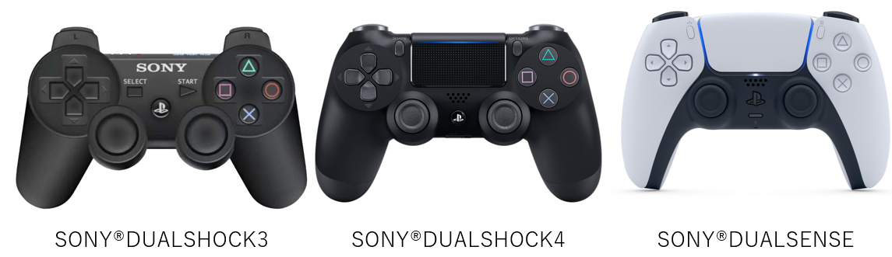

# ps_ros2_common

**Look at our better library!** -> [HarvestX/PlayStation-JoyInterface-ROS2](https://github.com/HarvestX/PlayStation-JoyInterface-ROS2)

<br>


Library for ROS2 that guarantees compatibility in variables of PS controllers of each generation. For SONY(R) Dualshock3, Dualshock4, Dualsense(For PS5)

**Note**
Please check your Ubuntu 20.04 kernel version `>= 5.13` for playstation HID with following command.
```bash
uname -r
```

---
## Table of contents (Click to jump to "main branch")

- [ps_ros2_common](https://github.com/Ar-Ray-code/ps_ros2_common#ps_ros2_common)
    - [Differenes in joysticks of each generation](https://github.com/Ar-Ray-code/ps_ros2_common#differences-in-joysticks-of-each-generation)
    - [Button layout & handling (FOR ROS2)](https://github.com/Ar-Ray-code/ps_ros2_common#button-layout--handling-for-ros2)
        - [DUALSHOCK3](https://github.com/Ar-Ray-code/ps_ros2_common#dualshock3)
        - [DUALSHOCK4](https://github.com/Ar-Ray-code/ps_ros2_common#dualshock4)
        - [DUALSENSE](https://github.com/Ar-Ray-code/ps_ros2_common#dualsense)
    - [How to connect? (Wireless)](https://github.com/Ar-Ray-code/ps_ros2_common#how-to-connect-wireless)
        - [DUALSHOCK4 & Dualsense(Wireless)](https://github.com/Ar-Ray-code/ps_ros2_common#dualshock4--dualsense-wireless)
        - [DUALSHOCK3(Wireless)](https://github.com/Ar-Ray-code/ps_ros2_common#dualshock3-wireless)
    - [How to remove or disable connection?](https://github.com/Ar-Ray-code/ps_ros2_common#how-to-remove-or-disable-connection)
    - [Library usage](https://github.com/Ar-Ray-code/ps_ros2_common#Library-usage)
        - [Tutorial](https://github.com/Ar-Ray-code/ps_ros2_common#Tutorial)
        - [Using the library](https://github.com/Ar-Ray-code/ps_ros2_common#using-the-library)
    - [For contributors](https://github.com/Ar-Ray-code/ps_ros2_common#for-contributors)
    - [License](https://github.com/Ar-Ray-code/ps_ros2_common#license)
    - [Other my contents](https://github.com/Ar-Ray-code/ps_ros2_common#other-my-contents)

---




## Differences in joysticks of each generation

| Name                 | DUALSHOCK3            | DUALSHOCK4            | DUALSENSE             |
| -------------------- | --------------------- | --------------------- | --------------------- |
| Model number         | CECHZC2xxx            | CUH-ZCT1(2)           | CFI-ZCT1J             |
| Weight[g]            | 193                   | 210                   | 280                   |
| Battery              | Lithium-ion 610?[mAh] | Lithium-ion 1000[mAh] | Lithium-ion 1560[mAh] |
| Dimensions[mm]       | 160x55x97             | 161x57x100            | 160x66x106            |
| Bluetooth Connection | Bluetooth Ver 2.0?    | Bluetooth Ver 2.1     | Bluetooth Ver 5.1     |
| USB Connection       | Mini USB Type-B       | micro USB Type-B      | Type-C                |


## Button layout & handling (FOR ROS2)

### DUALSHOCK3


| Button (Joy) name | joy-msgs (sensor_msgs/msg/joy) | Handling with "joy/ps3.h" |
| ----------------- | ------------------------------ | ------------------------- |
| Cross btn         | buttons[0]                     | cross_btn                 |
| Circle btn        | buttons[1]                     | circle_btn                |
| Triangle btn      | buttons[2]                     | triangle_btn              |
| Square btn        | buttons[3]                     | square_btn                |
| L1 btn            | buttons[4]                     | L1_btn                    |
| R1 btn            | buttons[5]                     | R1_btn                    |
| L2 analog         | buttons[6], axes[2]            | L2_btn, L2                |
| R2 analog         | buttons[7], axes[5]            | R2_btn, R2                |
| SELECT btn        | buttons[8]                     | select_btn                |
| SHARE btn         | None                           | share_btn=buttons[8]      |
| CREATE btn        | None                           | create_btn=buttons[8]     |
| START btn         | buttons[9]                     | start_btn                 |
| OPTIONS btn       | None                           | options_btn=buttons[9]    |
| PS btn            | buttons[10]                    | PS_btn                    |
| Up btn            | buttons[13]                    | up_btn, d_pad_x           |
| Down btn          | buttons[14]                    | down_btn, d_pad_x         |
| Left btn          | buttons[15]                    | left_btn, d_pad_y         |
| Right btn         | buttons[16]                    | right_btn, d_pad_y        |
| Joystick left x   | axes[0]                        | joy_left_x                |
| Joystick left y   | axes[1]                        | joy_left_y                |
| Joystick right x  | axes[3]                        | joy_right_x               |
| Joystick right y  | axes[4]                        | joy_right_y               |


### DUALSHOCK4

- The touch-pad button is similar to the touchpad on a laptop PC. (Not used for Joy-node.)


| Button (Joy) name | joy-msgs (sensor_msgs/msg/joy) | Handling with "joy/ps4.h" |
| ----------------- | ------------------------------ | ------------------------- |
| Cross btn         | buttons[0]                     | cross_btn                 |
| Circle btn        | buttons[1]                     | circle_btn                |
| Triangle btn      | buttons[2]                     | triangle_btn              |
| Square btn        | buttons[3]                     | square_btn                |
| L1 btn            | buttons[4]                     | L1_btn                    |
| R1 btn            | buttons[5]                     | R1_btn                    |
| L2 analog         | buttons[6], axes[2]            | L2_btn, L2                |
| R2 analog         | buttons[7], axes[5]            | R2_btn, R2                |
| SELECT btn        | None                           | select_btn=buttons[8]     |
| SHARE btn         | buttons[8]                     | share_btn                 |
| CREATE btn        | None                           | create_btn=buttons[8]     |
| START btn         | None                           | start_btn=buttons[9]      |
| OPTIONS btn       | buttons[9]                     | options_btn               |
| PS btn            | buttons[10]                    | PS_btn                    |
| Up btn            | **axes[6]**=  1                | up_btn, d_pad_x           |
| Down btn          | **axes[6]**= -1                | down_btn, d_pad_x         |
| Left btn          | **axes[7]**=  1                | left_btn, d_pad_y         |
| Right btn         | **axes[7]**= -1                | right_btn, d_pad_y        |
| Joystick left x   | axes[0]                        | joy_left_x                |
| Joystick left y   | axes[1]                        | joy_left_y                |
| Joystick right x  | axes[3]                        | joy_right_x               |
| Joystick right y  | axes[4]                        | joy_right_y               |

### Dualsense

- The touch-pad button is similar to the touchpad on a laptop PC. (Not used for Joy-node.)


| Button (Joy) name | joy-msgs (sensor_msgs/msg/joy) | Handling with "joy/ps5.h" |
| ----------------- | ------------------------------ | ------------------------- |
| Cross btn         | buttons[0]                     | cross_btn                 |
| Circle btn        | buttons[1]                     | circle_btn                |
| Triangle btn      | buttons[2]                     | triangle_btn              |
| Square btn        | buttons[3]                     | square_btn                |
| L1 btn            | buttons[4]                     | L1_btn                    |
| R1 btn            | buttons[5]                     | R1_btn                    |
| L2 analog         | buttons[6], axes[2]            | L2_btn, L2                |
| R2 analog         | buttons[7], axes[5]            | R2_btn, R2                |
| SELECT btn        | None                           | select_btn=buttons[8]     |
| SHARE btn         | None                           | share_btn=buttons[8]      |
| CREATE btn        | buttons[8]                     | create_btn                |
| START btn         | None                           | start_btn=buttons[9]      |
| OPTIONS btn       | buttons[9]                     | options_btn               |
| PS btn            | buttons[10]                    | PS_btn                    |
| Up btn            | *axes[6]*=  1                  | up_btn, d_pad_x           |
| Down btn          | *axes[6]*= -1                  | down_btn, d_pad_x         |
| Left btn          | *axes[7]*=  1                  | left_btn, d_pad_y         |
| Right btn         | *axes[7]*= -1                  | right_btn, d_pad_y        |
| Joystick left x   | axes[0]                        | joy_left_x                |
| Joystick left y   | axes[1]                        | joy_left_y                |
| Joystick right x  | axes[3]                        | joy_right_x               |
| Joystick right y  | axes[4]                        | joy_right_y               |

---


## How to connect? (Wireless)

- Assuming Ubuntu 20.04 LTS and ROS-Foxy. Target computer has to have Bluetooth.

### Dualshock4 & Dualsense (Wireless)

1. Open "Settings->Bluetooth".

2. Click the target "Wireless Controller" to setup. (Connection is created automatically.)


3. Created connection.


### Dualshock3 (Wireless)

1. Connect Dualshock3 and Target Computer by USB.
2. Push Dualshock3's "PS button".
3. Open "Settings->Bluetooth".
4. Select Dualshock3 Device to create Bluetooth connection.


## How to remove or disable connection?

1. Open "setting->Bluetooth".
2. (Disconnect the target joystick) : Turn off "Connection" status.

2. (Remove the target joystick) : Click "Remove Device -> Remove Device".


## Library usage

### Tutorial

- This tutorial assumes you have ros-foxy-desktop (Ubuntu20.04LTS)  and some tools installed.

```shell
$ cd ~
$ sudo apt install -y ros-foxy-joy*
$ mkdir -p ros2_ws/src/
$ cd ros2_ws/src/
$ git clone https://github.com/Ar-Ray-code/ps_ros2_common.git
$ cd ~/ros2_ws/
$ source /opt/ros/foxy/setup.bash
$ colcon build
$ source install/local_setup.bash
```

- Run example.

```shell
## Terminal 1
$ ros2 run joy joy_node

## Terminal 2
$ ros2 run ps_ros2_common joy_test

## Terminal 3
$ ros2 topic echo /output
```

When you connect your target controller to "/dev/input/js0", you can check "/output" topic! :smile::video_game:

If you want to use Dualshock4 or Dualsense, rewrite the first line of  "src/example_joy.cpp".

```c++
#include "joy/ps_base.hpp"
#define JOY_VERSION PS3
##                   ^ PS3 or PS4 or PS5 (Comment)

#include <example_interfaces/msg/int32.hpp>

#if JOY_VERSION == PS5
    #include "joy/ps5.hpp"
    using namespace ps5;
#elif JOY_VERSION == PS4
    #include "joy/ps4.hpp"
    using namespace ps4;
#elif JOY_VERSION == PS3
    #include "joy/ps3.hpp"
    using namespace ps3;
#endif

...
```


### Using the library

 View this repository folder map. If you will use this library, you have to copy "include/joy/*" and write the PATH.


 "ps3.hpp"and"ps4.hpp","ps5.hpp" is for override "ps_base.hpp"'s' functions.

 The following is a simple sample program.

```c++
#include "joy/ps_base.hpp"
#define JOY_VERSION PS3

#if JOY_VERSION == PS5
    #include "joy/ps5.hpp"
    using namespace ps5;
#elif JOY_VERSION == PS4
    #include "joy/ps4.hpp"
    using namespace ps4;
#elif JOY_VERSION == PS3
    #include "joy/ps3.hpp"
    using namespace ps3;
#endif

class example_joy:public rclcpp::Node, public ps
{
    public:
        void sub_joy_thread(const sensor_msgs::msg::Joy::SharedPtr msg)
        {
            get_data(msg);

            std::system("clear");
            std::cout << "square_btn:" << square_btn << std::endl;
			// Write your code !
        }

        example_joy(const std::string name, const rclcpp::NodeOptions & options):Node(name, options)
        {
            sub_joy = this->create_subscription<sensor_msgs::msg::Joy>("/joy", 1, std::bind(&ps::sub_joy_thread, this, std::placeholders::_1));
        }
};

int main(int argc, char** argv)
{
    rclcpp::init(argc, argv);
    rclcpp::NodeOptions options;
    auto node = std::make_shared<example_joy>("joy_test",options);

    rclcpp::spin(node);
    rclcpp::shutdown();
    return 0;
}
```


### Class reference(ps_base.hpp)

**Methods**

- ps_base::ps_base()
  - Initialize ps_base class.
- virtual void ps_base::get_data(const sensor_msgs::msg::Joy::SharedPtr msg)=0
  - Assign the data of "sensor_msgs::msg::Joy" to the member variable.
- virtual void ps_base::sub_joy_thread(const sensor_msgs::msg::Joy::SharedPtr msg)
  - Callback function. You can override it.
- void ps_base::btn2d_pad()
  - About the D-pad , handling button data to axis data.
- void ps_base::d_pad2btn()
  - About the D-pad , handling axis data to button data.
- void ps_base::init_data()
  - Initialize members.

**Members**

- `rclcpp::Subscription<sensor_msgs::msg::Joy>::SharedPtr sub_joy`

- bool up_btn
- bool down_btn
- bool right_btn
- bool left_btn
- bool square_btn
- bool square_btn
- bool circle_btn
- bool triangle_btn
- bool cross_btn
- bool L1_btn
- bool R1_btn
- bool select_btn
- bool start_btn
- bool PS_btn
- bool share_btn
- bool options_btn
- bool create_btn
- bool R2_btn
- bool L2_btn
- float R2
- float L2
- float d_pad_x
- float d_pad_y
- float joy_left_x
- float joy_left_y
- float joy_right_x
- float joy_right_y

## For contributors

- If you use other Joy controllers, write a program similar to "include/joy/ps5.hpp".
  And if you have the opportunity, please contribute to this repository! :video_game:
- I am a student and a beginner in the program. :man_student: If you have a better suggestion, please give me your ideas.

## License

- Apache License 2.0 : https://github.com/Ar-Ray-code/ps_ros2_common/blob/main/LICENSE

## Other my contents

- Twitter : https://twitter.com/Ray255Ar
- BLOG(JP) : https://ar-ray.hatenablog.com/

